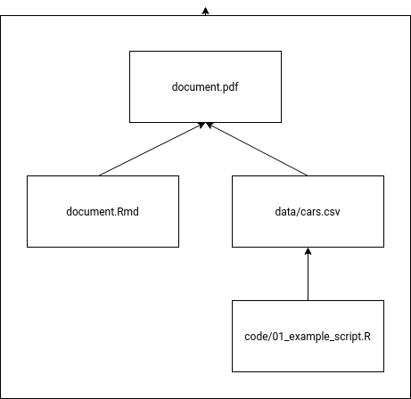

# Template for Transparent Research

## Introduction

This repository is a template for using
[Rmarkdown](https://rmarkdown.rstudio.com/), [Docker](https://www.docker.com/),
and [GNU Make](https://www.gnu.org/software/make/) to create and communicate
transparent, reproducible, and error-free research.  These tools automate the
minutiae of managing dependencies, updating calculations with new data, and
transcribing results, leaving you to focus on the important parts of research.

R-Markdown allows you to integrate the results of your analysis directly into
your research reports. GNU Make ensures that changes to one part of your code
are carried through the entire analysis process, so figures downstream are
always re-calculated when the data and code they depend on are updated.  Docker
ensures that your research runs the same on any machine, allowing others to
easily replicate and contribute to your research.

## Managing Dependencies with GNU Make

[GNU Make](https://www.gnu.org/software/make/) automates the process of
re-running analysis when "upstream" code or data on which it depends changes.
This frees you up to focus on the important parts of research, and gives
confidence that your calculations are always based on the up-to-date figures
from upstream.

### Dependency Chart for the Example Project



## Replication With Docker

First, build the docker container. This will download and install all of the
required dependencies.

```
docker build -t reproduce .
```

Then, depending on your operating system, start the docker container in one of
two ways:

### Using Linux / Mac / Windows Power Shell:

```
docker run --rm -v ${PWD}:/opt/reproduce reproduce
```

### Using Windows Command Line:
```
docker run --rm -v  %cd%:/opt/reproduce reproduce
```

Once the container is up and running, any changes you make to the code or data
will be propagated through to the final report.

